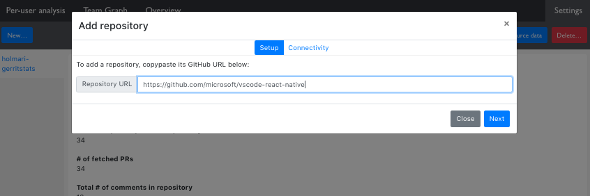
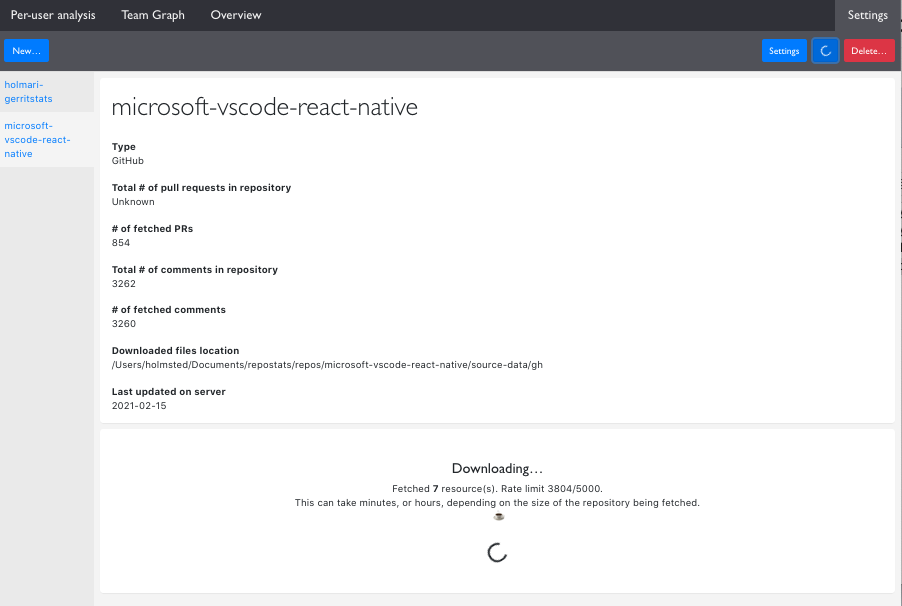
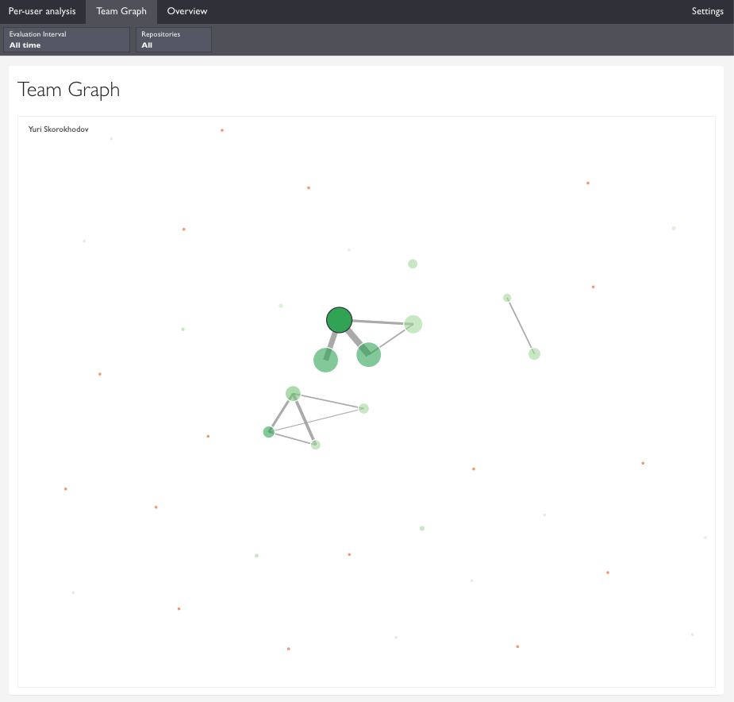
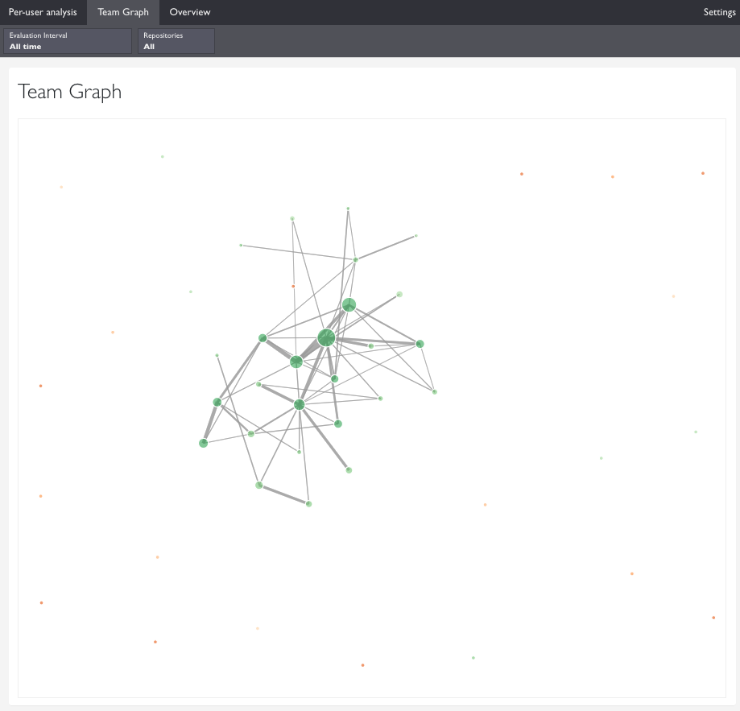
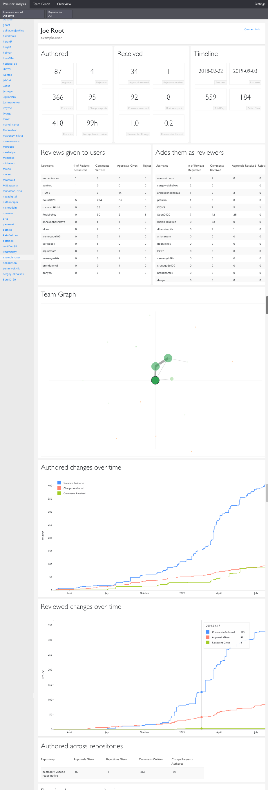

# RepoStats

This application allows producing powerful analytics about teams and their interaction
in the context of code reviews.

RepoStats supports fetching data from GitHub at the moment, but is designed to also support other
code review tools like Gerrit that support fetching metadata about the code reviews using
an HTTP API.

## Quickstart

to run the backend (http://localhost:3001):

```
cd server; npm run watch
```

to run the frontend (http://localhost:3000):

```
cd client; npm run start
```

More detailed instructions in the separate READMEs for the client and server.

## Motivation

The tool can be useful for analysing how efficiently code reviews are implemented in an organization,
and what kind of virtual teams are formed in the review process.

Code reviews are a key part of engineering culture, and in distributed organizations, one of the
key parts how teams interact as well. It's essential to be able to understand how an organization
conducts its code reviews - the larger the organization, the more there is risk of different
behaviors forming between teams, and the harder it is for any given person to see best practices.
At my employer, Alloy, we care deeply about code reviews - we've done always them. At my former
employer, Nokia, we also cared deeply about reviews, and used GerritStats to understand how those
reviews were performed.

Code reviews are all about communication between people, and they're a fantastic tool for mentoring
others, teaching best practices, and learning oneself about how to write better code. They can also
serve as a great tool to improve one's codebase over time! However, reviews need to be conducted
by everyone in the team, and they're also not a crutch for having someone else clean up after you.

To understand these behaviors, RepoStats provides insight into who writes comments to whom, how
the team interacts with each other, and even what exactly the comments were that a given person wrote.
This tool doesn't try to offer interpretations as to why you're seeing specific behaviors, but it
can help with identifying silos, organizational risk due to a low bus factor, and other similar cases.

## Architecture

There are two components; client and server. Both are written in TS, but share no code. The server
is a node.js / express server that is responsible for fetching source data and storing it locally,
as well as for processing analysis requests and serving those to the frontend. The server also has
a simple caching layer.

Only the filesystem is used for storing the data - no database is used. This makes it simple to
debug problems and simplifies the overall design.

The client is responsible for rendering the web frontend - React / TS. The frontend
is not responsible for computing anything meaningful - at most, it does a bit of summing. All the
analysis aggregations happen on the server side. The frontend relies on the server's cache to be
performant - computing the results can take ~30s-1min on a powerful laptop, but once the results
are cached, the results are served in less than a second.

A common workflow is to first set up a repository and fetch all of its data once, and then
incrementally update it. The first fetch can take hours when using GitHub because of rate limits -
large repositories can have tens of thousands of files that need to be downloaded, and the rate
limit is 5000 requests per hour. To make this less painful, incremental fetching is supported.

Another common workflow is to look at analytics across multiple repositories. Large
organizations often break their codebase into separate repositories - there can hundreds
or thousands of repositories for large projects like complex consumer devices. To support tracking
analytics across multiple repositories, the user can configure as many repositories as they'd like;
all of them are taken into account by default when computing the analytics results.

## Extending

To support other code review tools like Gerrit, add a new connector. A connector defines how
the RepoStats server connects to a code review tool like GitHub.

See `ConnectorType` for details: try adding a new connector type like 'GERRIT' into the union type,
and see what kind of type errors you'll get.

The frontend's analysis components need no adaptations when a new connector type is added, but
the repository settings page will need small modifications.

## History

This project is based off of https://github.com/holmari/gerritstats - a Gerrit-specific tool that
provides analytics around code reviews from Gerrit. I chose to rewrite GerritStats instead of trying
to maintain that project for a couple of reasons. First, I don't use Gerrit right now, and second,
GerritStats had a lot of ugly hacks in how the frontend worked, and the backend uses the deprecated
SSH connector, instead of Gerrit's REST API, which (of course) has different interface than
the SSH-based API.

## Screenshots

To set up a repository, all you need is the GitHub URL,


You also need the GitHub OAuth token, which any GitHub user can acquire:


Once you have set up the repository, you can download the data:


After loading the data, you can trigger computations that allow e.g. seeing graphs illustrating
how the authors communicate with each other. This one is for a relatively small repository,
where two separate teams have formed:


This is a team graph for a large repository with one large team that communicates heavily
with each other:


The core of the tool is the user analysis tool which provides a multitude of statistics about
a given user:

